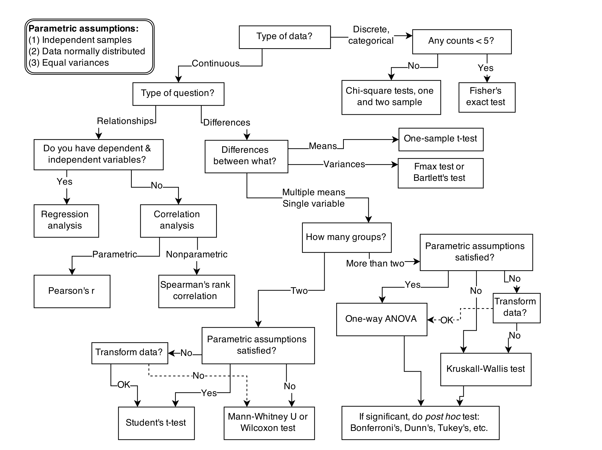

These are notes from Chapter 1 of the Statistical Rethinking Book (Richard McElreath)

## 1.1. Statistical Golem

* Scientists also make golems. These golems are scientific models. But these golems have real effects on the world, through the predictions they make and the intuitions they challenge or inspire.
* Scientific models are **neither true nor false**, neither prophets nor charlatans. Rather they are constructs engineered for some purpose.

* The golem is a prosthesis, doing the measuring for us, performing impressive calculations, finding patterns where none are obvious.
* Statistics is neither mathematics nor a science, but rather a branch of engineering. And like engineering, a common set of design principles and constraints produces a great diversity of specialized applications.
* The classical procedures of introductory statistics tend to be **inflexible and fragile**. By inflexible, I mean that they have very limited ways to adapt to unique research contexts. By fragile, I mean that they fail in unpredictable ways when applied to new contexts.
* What researchers need is **some unified theory of golem engineering, a set of principles for designing, building, and refining special-purpose statistical procedures**. Every major branch of statistical philosophy possesses such a unified theory. But the theory is never taught in introductory—and often not even in advanced—courses. So there are benefits in rethinking statistical inference as a set of strategies, instead of a set of pre-made tools.

## 1.2. Statistical Rethinking

* The greatest obstacle that I encounter among students and colleagues is the tacit belief that the proper objective of statistical inference is to test null hypotheses. This is the proper objective, the thinking goes, because Karl Popper argued that science advances by falsifying hypotheses. But the above is a kind of folk Popperism, an informal philosophy of science common among scientists but not among philosophers of science.
* In fact, deductive falsification is impossible in nearly every scientific context, because:
  * Hypotheses are not models.
  * Measurement matters.
  
### 1.2.1. Hypotheses are not models.

* When we attempt to falsify a hypothesis, we must work with a model of some kind. Even when the attempt is not explicitly statistical, there is always a tacit model of measurement, of evidence, that operationalizes the hypothesis. All models are false, so what does it mean to falsify a model? One consequence of the requirement to work with models is that it’s no longer possible to deduce that a hypothesis is false, just because we reject a model derived from it.
