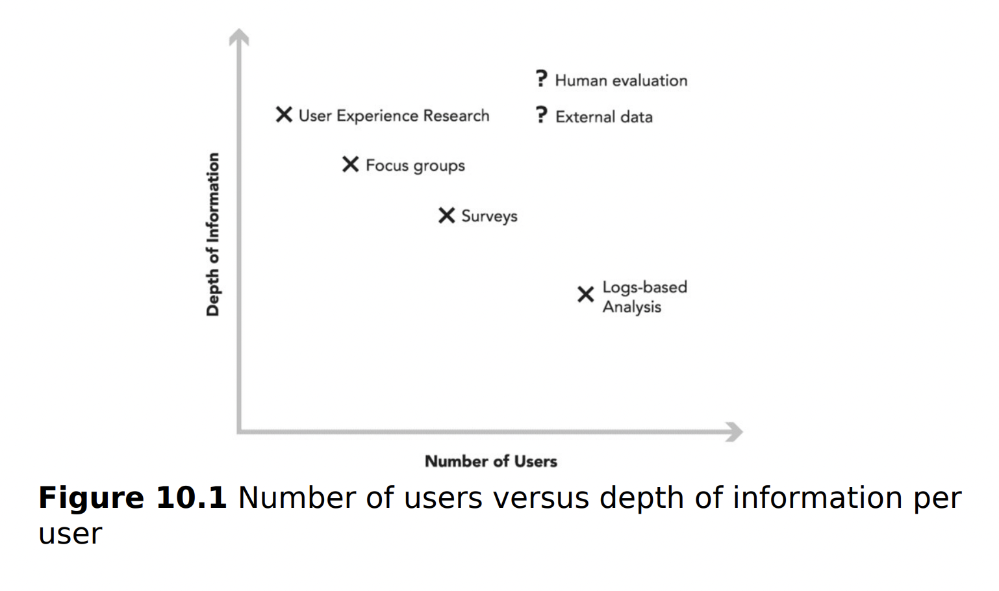

These are notes from the book "Trustworthy Online Controlled Experiments" (Diane Tang, Ron Kohavi, and Ya Xu)

* Complementary techniques include user experience research study, surveys, focus groups and human evaluations - used in conjunction with online controlled experiments. Data scientists can use these methods to generate and evaluate ideas in an idea funnel before investing in an online experiment, and to generate and evaluate metrics as surrogate metrics in an online experiment.
* Observational causal studies when online controlled experiments are not possible.

## 1. Complementary Techniques

* **Why should we care?** when running experiments, we also need to test, create and validate metrics, and establish evidence to support broader conclusions. Complementary techniques and observation studies complement and augment healthy A/B testing culture.

### 1.1. The Space of Complimentary Techniques

* In addition to the care and rigor in analysis, and in the creation of the experiment platform and tools, to be successful in A/B testing, we also need:
  * **Idea funnel**: the ideas for experiments
  * Validated metrics to measure the effects we care about
  * Evidence to support or refute hypotheses, when running a controlled experiment is either not possible or insufficient.
  * (Optional) Metrics that compliment the metrics from the online controlled experiment.
* For ideas that are easy to implement, we recommend running an online experiment directly.
* For ideas that are more expensive, we can use the complementary techniques for early evaluation and idea pruning to reduce experimentation cost.
* As another example for using complementary techniques, what if **you want a reliable proxy metric** for user satisfaction, a concept that is quite difficult to measure. You can run a **survey** and gather self-reported user satisfaction data, and then analyze **instrumented logs data** to see what large-scale observational metrics correlate with the survey results. You can extend this further by running controlled experiments to validate the proposed proxy metrics.
* The methods we discuss in this chapter vary along two axes: scale (i.e., number of users) vs. depth of information per user.

### 1.2. Log-based analysis (retrospective analysis)

* **Requirements:** having proper instrumentation of user views, actions, and interactions to compute metrics for evaluating controlled experiments.
* Log-based analysis helps with:
  * **Building intuition:** can help answer questions such as (1) What is the distribution of sessions-per-user or
click-through rate?; (2) What is the difference by key segments, such as by country or platform; (3) How do these distributions shift over time?; (4) How are users growing over time? Building this intuition helps you understand your **product and system baseline**, what the **variance** is, what is happening **organically** independent of experimentation, **what size change might be practically significant**, and more.
  * **Characterizing potential metrics:** Building intuition is the precursor for characterizing potential metrics. Characterization helps you understand the variance and distributions, how new metrics correlate with existing metrics. Log-based analyses establish understanding of how a potential metric might perform on past experiments.
  * **Generating ideas for A/B experiments** based on exploring the underlying data: for example, you can examine
the conversion rate at each step of the purchase funnel to identify large drop offs.
  * You can explore whether ideas generated using these complementary techniques **happen at-scale** and are **worth investing time** implementing and evaluating using an A/B experiment.
  * **Natural experiments:** These occur occasionally, either due to exogenous circumstances (e.g., an external company changing a default) or bugs (e.g., a bug that logs all users out). In those cases, run an observational analysis (see Chapter 11) to measure the effect. 
  * **Observational causal studies**: You can run these studies when experiments are not possible, for example, you can use quasi-experimental designs. When you use quasi-experimental designs in combination with experiments, they can lead to an improved inference of a more general result.
* **Limitation**: can only infer what will happen in the future based on what happened in the past. For example, you may decide not to further invest in the e-mail attachment feature because current usage is small; however, the current low usage might have been caused by the fact that it is difficult to use, which logs-based analysis may not reveal.

### 1.3. Human Evaluation

* **What is it?** Human evaluation is where a company pays a human judge, also called a rater, to complete some task. The results are then used in subsequent analysis. This is a common evaluation method in search and recommendation systems.
* Typically, multiple raters are assigned the same task, as raters may disagree; you can use various voting or other disagreement resolution mechanisms to obtain high-quality aggregate labeling.
* **Limitations:**
  * Raters are generally not your end users. Raters are doing tasks assigned to them – often in bulk, whereas your product is something your end users come by organically to their lives.  
  *  Raters can miss the **local context** of real users. For example, the search query "5/3" to many raters is an arithmetic query and will expect the result 1.667, yet users living near the “Fifth Third Bank,” whose logo is "5/3," are looking for the bank information. 
* It is best to think that your human evaluation provides calibrated labeled data to complement data gathered from real users.
* You can use metrics based on human evaluation as additional metrics for evaluating A/B experiments. For example: 
  * You can ask raters to rate results from either Control or Treatment for a given query and aggregate the ratings to see which variant is preferred.
  * Or use a side-by-side experiment, where Control and Treatment search results are shown side by side, and raters asked which side is "better." (Bing and Google)
* Human evaluation results are also useful for **debugging**: you can examine the results in detail to understand where changes perform well and poorly.
* You can also **pair human evaluation with log-based analysis** to understand what observed user actions correlate with highly relevant results for a query.

### 1.4. User Experience Research (UER)

* **What is it?**  Observing users doing tasks of interest and answering questions in either a lab setting or in situ. This type of research is in-depth and intensive typically with at most tens of users, and is useful for generating ideas, spotting problems, and gaining insights from direct observation and timely questions.
* These type of field and lab studies can include:
  * Special equipment to gather data, such as eyetracking that you cannot gather from your instrumentation.
  * Diary studies, where users self-document their behavior longitudinally, are useful for gathering data analogous to online instrumentation but augmented with data you cannot gather via instrumentation, such as user intent or offline activities.
* These techniques can be useful for **generating metric ideas** based on correlating "true" user intent with what we observe via instrumentation. You must validate these ideas using methods that scale to more users, such as **observational analyses and controlled experiments**.